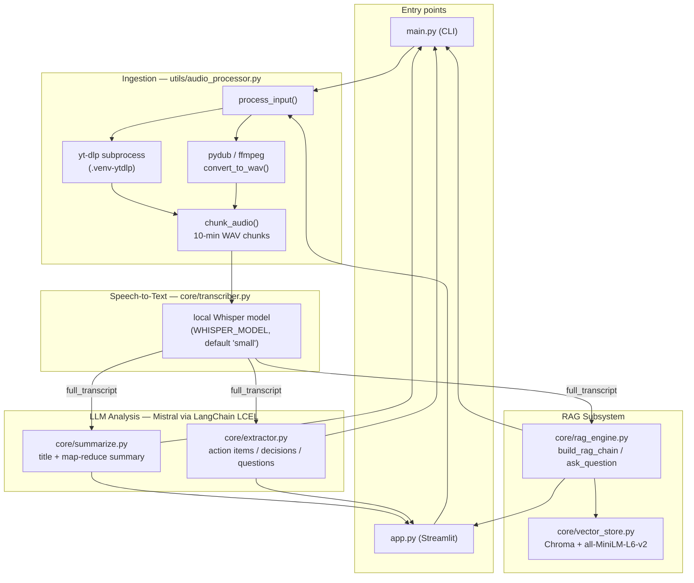
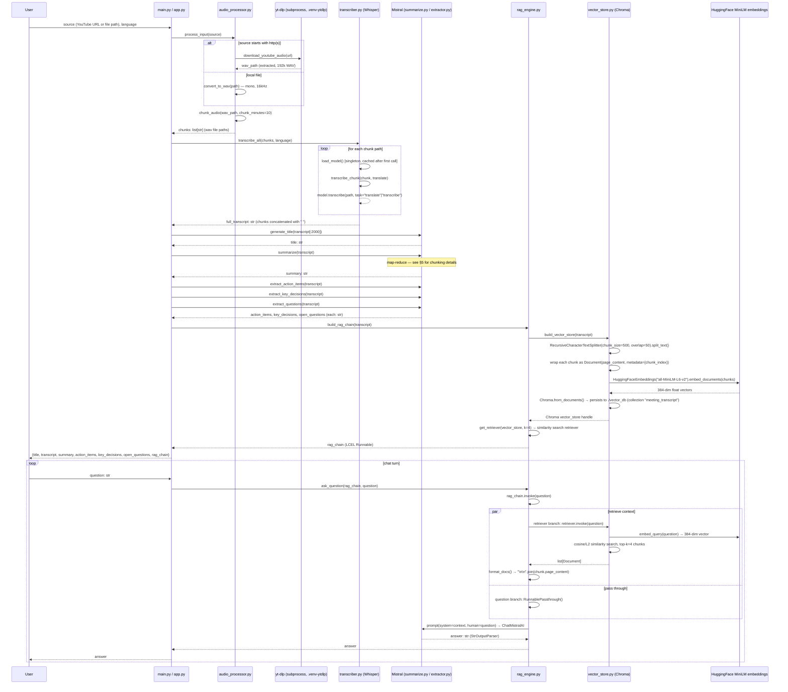

# VideoAgent — AI Video/Meeting Assistant

An agent that takes a YouTube URL or a local audio/video file, transcribes it (local Whisper), and then uses an LLM (Mistral, via LangChain LCEL) to generate a title, summary, action items, key decisions and open questions — plus a RAG chat interface (Chroma + HuggingFace embeddings) so the user can ask free-form questions against the transcript.

Two entry points share the same core pipeline:
- [main.py](main.py) — CLI
- [app.py](app.py) — Streamlit UI

---

## 1. Folder structure

```
VideoAgent/
├── main.py                    # CLI entry point (run_pipeline + chat loop)
├── app.py                     # Streamlit UI entry point (duplicates the pipeline, adds progress UI)
├── test.py                    # ad-hoc manual test script (download + transcribe one hardcoded URL)
├── requirements.txt
├── .env                       # API keys / config (not committed logic, but present locally)
├── core/
│   ├── extractor.py           # action items / decisions / open questions (Mistral LCEL chains)
│   ├── summarize.py           # map-reduce summary + title generation (Mistral)
│   ├── transcriber.py         # local Whisper transcription
│   ├── translator.py          # currently empty (placeholder)
│   ├── rag_engine.py          # builds the RAG chain, answers questions
│   └── vector_store.py        # Chroma vector store + HuggingFace embeddings
├── utils/
│   └── audio_processor.py     # yt-dlp download / ffmpeg convert / chunk audio
├── downloads/                 # generated .wav files + chunked .wav pieces (runtime output)
└── .venv-ytdlp/                # isolated Python 3.12 venv used only to run yt-dlp as a subprocess
```

---

## 2. High-Level Design (HLD)



**Key design points**
- Everything downstream of transcription operates on **one big transcript string** — there is no per-segment timestamp tracking; chunking exists only to keep audio files small enough for Whisper/network I/O, not for retrieval granularity.
- The RAG subsystem re-chunks that same transcript independently (500 chars / 50 overlap) purely for embedding/retrieval — a different chunk size than the audio chunking (10 minutes of audio).
- Mistral (`mistral-small-latest`) is the single LLM used everywhere (title, summary, extraction, RAG answers) — four independent chains, each built fresh per call via `get_llm()`.

---

## 3. End-to-end Data Flow (sequence diagram)



---

## 4. Low-Level Design (LLD) — module & function reference

### 4.1 `utils/audio_processor.py`

| Function | Input | Output | Side effects |
|---|---|---|---|
| `download_youtube_audio(url: str)` | YouTube URL | `str` path to downloaded `.wav` | Shells out to `yt-dlp` binary inside `.venv-ytdlp` (isolated Python 3.12 env, since recent yt-dlp needs ≥3.10 but the main env is pinned for torch/whisper). Extracts audio, converts to WAV @192k quality, writes into `downloads/`. Raises `RuntimeError` on non-zero exit code. |
| `convert_to_wav(input_path: str)` | Local file path (audio or video) | `str` path to `<name>_converted.wav` | Uses `pydub`/ffmpeg to downmix to mono and resample to 16kHz (the format Whisper expects). Writes new file next to the source. |
| `chunk_audio(wav_path: str, chunk_minutes: int = 10)` | WAV path | `list[str]` of chunk file paths | Slices the WAV into fixed 10-minute pieces (`<path>_chunk_<i>.wav`), each written to disk in `downloads/`. |
| `process_input(source: str)` | URL or local path | `list[str]` chunk paths | Orchestrator: dispatches to `download_youtube_audio` or `convert_to_wav` based on `http(s)://` prefix, then always calls `chunk_audio`. This is the single function both `main.py` and `app.py` call to go from "user input" → "audio chunks ready for STT". |

### 4.2 `core/transcriber.py`

| Function | Input | Output | Notes |
|---|---|---|---|
| `load_model()` | — | Whisper model object | Lazily loads once into module-level `_model` singleton; model size from `WHISPER_MODEL` env var (default `"small"`). |
| `transcribe_chunk(chunk_path: str, translate: bool = False)` | one chunk WAV path | `str` text for that chunk | `task="translate"` makes Whisper translate any language directly to English text; `task="transcribe"` keeps the spoken language. |
| `transcribe_all(chunks: list, translate: bool = False)` | list of chunk paths | `str` — all chunk texts concatenated with `" "` | Iterates chunks in order, calls `transcribe_chunk` on each, and returns the joined `full_transcript` that every downstream function operates on. |

**⚠️ Behavioral note (see §6):** callers pass a `language` string (`"english"`/`"hinglish"`) into the `translate` **bool** parameter positionally — both strings are truthy, so `task` is effectively always `"translate"` regardless of the selected language.

Also defined but **unused**: `SARVAM_API_KEY`, `SARVAM_STT_TRANSLATE_URL`, `SARVAM_MODEL`, `SARVAM_PIECE_SECONDS`. These look like scaffolding for a planned Sarvam AI hinglish STT-translate integration (per the commit history) that isn't actually wired into `transcribe_chunk`/`transcribe_all` yet — transcription today is 100% local Whisper.

`core/translator.py` is currently an empty file — no logic lives there yet.

### 4.3 `core/summarize.py`

| Function | Input | Output | Notes |
|---|---|---|---|
| `get_llm()` | — | `ChatMistralAI` instance | `mistral-small-latest`, `temperature=0.3`, key from `MISTRAL_API_KEY`. |
| `split_transcript(transcript: str)` | full transcript | `list[str]` chunks | `RecursiveCharacterTextSplitter(chunk_size=3000, chunk_overlap=200)` — this is the "map" split, independent from the RAG splitter in `vector_store.py`. |
| `summarize(transcript: str)` | full transcript | `str` final summary | **Map step:** each 3000-char chunk → `map_chain.invoke({"text": chunk})` → one partial summary per chunk. **Reduce step:** joins partial summaries, feeds them through a second "combine" prompt/chain to produce one bulleted meeting summary. |
| `generate_title(transcript: str)` | full transcript (only first 2000 chars used) | `str` short title (≤8 words) | Single LLM call. |

### 4.4 `core/extractor.py`

| Function | Input | Output | Notes |
|---|---|---|---|
| `get_llm()` | — | `ChatMistralAI` | Same model, `temperature=0.2`. |
| `build_chain(system_prompt: str)` | a system prompt string | LCEL `Runnable` | Shared chain builder: wraps input as `{"text": transcript}`, injects it into `[system_prompt, human="{text}"]`, pipes through the LLM and `StrOutputParser()`. |
| `extract_action_items(transcript)` | full transcript | `str` numbered list (task/owner/deadline) or `"No action items found."` | |
| `extract_key_decisions(transcript)` | full transcript | `str` numbered list or `"No key decisions found."` | |
| `extract_questions(transcript)` | full transcript | `str` numbered list or `"No open questions found."` | |

All three run the **entire, un-chunked transcript** through a single LLM call — no map-reduce here (unlike `summarize`), so very long meetings could exceed the model's context window.

### 4.5 `core/vector_store.py` — embeddings & vector DB

| Function | Input | Output | Notes |
|---|---|---|---|
| `get_embeddings()` | — | `HuggingFaceEmbeddings` | Model: `all-MiniLM-L6-v2` (384-dim), runs on CPU locally — no external embedding API call. |
| `build_vector_store(transcript: str)` | full transcript | `Chroma` vector store handle | 1) Splits transcript via `RecursiveCharacterTextSplitter(chunk_size=500, chunk_overlap=50)`. 2) Wraps each chunk as a `Document(page_content=chunk, metadata={"chunk_index": i})`. 3) Embeds all chunks and writes them via `Chroma.from_documents(...)` into a **persistent** store on disk at `persist_directory="vector_db"`, collection name `"meeting_transcript"`. |
| `load_vector_store()` | — | `Chroma` handle | Re-opens the same persisted collection without rebuilding/re-embedding (used for a "reconnect" flow — see `load_rag_chain` below). |
| `get_retriever(vector_store, k=4)` | a `Chroma` instance | LangChain retriever | `search_type="similarity"`, returns top-`k=4` nearest chunks per query. |

**How embeddings actually get created, step by step:**
1. Transcript text → `RecursiveCharacterTextSplitter` → list of ~500-char overlapping string chunks.
2. Each chunk → `Document` object (LangChain's text+metadata container).
3. `HuggingFaceEmbeddings("all-MiniLM-L6-v2")` encodes each chunk's text into a 384-dimension float vector, all on CPU, no network call (weights download once from HuggingFace Hub, then run locally via `sentence-transformers`).
4. `Chroma.from_documents(...)` stores `(vector, page_content, metadata)` triples in a local Chroma collection and persists them to `./vector_db` on disk (SQLite + Parquet-backed under the hood).
5. At query time, the same embedding model encodes the user's question into a vector; Chroma runs a similarity search against the stored vectors and returns the `k` nearest `Document`s.

### 4.6 `core/rag_engine.py`

| Function | Input | Output | Notes |
|---|---|---|---|
| `get_llm()` | — | `ChatMistralAI` | `temperature=0.3`. |
| `format_docs(docs: list[Document])` | retrieved documents | `str` | Joins `doc.page_content` for all `k` retrieved chunks with `"\n\n"` — this becomes the `{context}` in the prompt. |
| `build_rag_chain(transcript: str)` | full transcript | LCEL `Runnable` ("rag_chain") | Builds a fresh vector store (`build_vector_store`), wraps it in a retriever (`k=4`), then composes the LCEL graph: `{"context": retriever \| format_docs, "question": RunnablePassthrough()} \| prompt \| llm \| StrOutputParser()`. This is the object stored in `result["rag_chain"]` and reused for every chat turn. |
| `load_rag_chain()` | — | *(currently incomplete — see §6)* | Intended to reconnect to an already-persisted vector store (via `load_vector_store()`) without re-embedding, for a "resume a previous session" flow. Not called anywhere in `main.py`/`app.py` today. |
| `ask_question(rag_chain, question: str)` | the chain from `build_rag_chain`, plus a question string | `str` answer | `rag_chain.invoke(question)` — triggers the retrieve → format → prompt → LLM → parse flow described in §3. |

### 4.7 `main.py` (CLI orchestrator)

`run_pipeline(source, language="english") -> dict` wires §4.1–4.6 together in order and returns:
```python
{
  "title": str, "transcript": str, "summary": str,
  "action_items": str, "key_decisions": str, "open_questions": str,
  "rag_chain": Runnable,
}
```
The `if __name__ == "__main__"` block prompts for `source` + `language`, prints all the fields, then loops on `input("You: ")` calling `ask_question(rag_chain, question)` until the user types `exit`/`quit`/`q`.

### 4.8 `app.py` (Streamlit UI)

Re-implements the same step sequence inline (not by calling `run_pipeline`) so it can update `st.session_state.pipeline_steps` between each step and drive the sidebar's live status dots (`pending → active → done`). Results are cached in `st.session_state.result`; chat turns append `{role, content}` pairs to `st.session_state.chat_history` and re-render on each `st.rerun()`.

**⚠️ See §6 — as currently written this file has an import that will fail before the app can start.**

---

## 5. Chunking sizes at a glance

| Stage | Splitter | Size | Overlap | Purpose |
|---|---|---|---|---|
| Audio ingestion | `pydub` slicing | 10 minutes | none | Keep individual Whisper calls / file sizes manageable |
| Summarization (map step) | `RecursiveCharacterTextSplitter` | 3000 chars | 200 chars | Fit under LLM context window per map call |
| RAG embeddings | `RecursiveCharacterTextSplitter` | 500 chars | 50 chars | Fine-grained retrieval — smaller chunks = more precise semantic matches |

These three splitters are independent of each other and re-derived from the same `full_transcript` string each time.

---

## 6. Known issues / current bugs

These were found while reading the code as-is — documented here rather than silently glossed over, since they affect the *actual* runtime behavior described above.

1. **`app.py` import will fail at startup.**
   [app.py:6](app.py:6) does `from core.summarizer import summarize, generate_title`, but the module is named [core/summarize.py](core/summarize.py) (no trailing `r`). There is no `core/summarizer.py` anywhere in the project, so `streamlit run app.py` will raise `ModuleNotFoundError` before the UI ever renders.

2. **Language selection doesn't do what it looks like it does.**
   [main.py:16](main.py:16) and [app.py:387](app.py:387) call `transcribe_all(chunks, language)` positionally, but `transcribe_all`'s second parameter is `translate: bool` ([core/transcriber.py:42](core/transcriber.py:42)). Both `"english"` and `"hinglish"` are non-empty strings, hence always truthy → Whisper always runs with `task="translate"`, regardless of which language the user picks in the dropdown/CLI prompt.

3. **`summarize()` is broken and will raise at runtime.**
   [core/summarize.py:49-53](core/summarize.py:49):
   - `StrOutputParser` is piped in as a **class**, not an instance (`StrOutputParser()` is what's used correctly two lines above in `map_chain`).
   - `combined_chain.invoke()` is called with **no argument**, but the chain starts with `RunnablePassthrough()` expecting an input — this raises `TypeError: invoke() missing 1 required positional argument`. It should be `combined_chain.invoke(combined)`.
   Since both `main.py` and `app.py` call `summarize(transcript)` unconditionally, the pipeline currently cannot complete past this step.

4. **`load_rag_chain()` is incomplete / would error if called.**
   [core/rag_engine.py:57-82](core/rag_engine.py:57): calls `get_retriever()` with no arguments even though it requires a `vector_store` positional arg, and assigns a bare `ChatPromptTemplate` (not composed with the retriever/LLM/parser) to `rag_chain`. It's not currently called from `main.py` or `app.py`, so this dead code doesn't block the working path, but it isn't a usable "resume session" entry point yet.

5. **The Sarvam integration is scaffolding only.** Constants (`SARVAM_API_KEY`, `SARVAM_MODEL`, etc., [core/transcriber.py:8-16](core/transcriber.py:8)) and `core/translator.py` (empty file) suggest a planned Sarvam STT-translate path for Hinglish, but nothing in `transcribe_chunk`/`transcribe_all` calls the Sarvam API today.

6. **Vector store is not scoped per video/session.** `build_vector_store` always writes to the same persistent Chroma collection (`vector_db/`, collection `"meeting_transcript"`), and chunk metadata only carries `chunk_index` — no video/session ID. Running the pipeline on a second video adds its chunks into the *same* collection as the first, so a RAG query could retrieve context from a previously processed, unrelated video if `vector_db/` isn't cleared between runs.

7. **Minor:** [main.py:17](main.py:17) — `print("raw transcription (first 300 characters) {transcript[:300]}")` is missing the `f` prefix, so it prints the literal `{transcript[:300]}` instead of interpolating.

8. **`MISTRAL_API_KEY` is not present in the checked-in `.env`**, even though `summarize.py`, `extractor.py`, and `rag_engine.py` all require it. It must be exported separately (shell env or added to `.env`) or every LLM call will fail on Mistral auth.

---

## 7. Environment variables

| Variable | Used in | Purpose | Status |
|---|---|---|---|
| `MISTRAL_API_KEY` | summarize.py, extractor.py, rag_engine.py | Auth for all Mistral LLM calls | **Required, not currently in `.env`** |
| `WHISPER_MODEL` | transcriber.py | Local Whisper model size (`tiny`/`base`/`small`/`medium`/`large`) | Optional, default `"small"` |
| `SARVAM_API_KEY` | transcriber.py (declared only) | Planned Sarvam STT-translate auth | Present in `.env`, not yet wired into any call |
| `SARVAM_STT_MODEL` | transcriber.py (declared only) | Planned Sarvam model name | Present in `.env`, default fallback `"saaras:v2.5"`, not yet wired in |
| `HUGGINGFACEHUB_API_TOKEN` | — | Present in `.env` | Not referenced by any VideoAgent module (embeddings run fully local) |
| `GOOGLE_API_KEY`, `OPENWEATHER_API_KEY`, `TAVILY_API_KEY` | — | Present in `.env` | Not referenced anywhere in this folder — likely shared with other agents in this repo |

---

## 8. How to run

```bash
pip install -r requirements.txt
python3.12 -m venv .venv-ytdlp && .venv-ytdlp/bin/pip install yt-dlp   # one-time, isolated yt-dlp env
```

CLI:
```bash
python main.py
```

Streamlit UI (once the import bug in §6.1 is fixed):
```bash
streamlit run app.py
```
